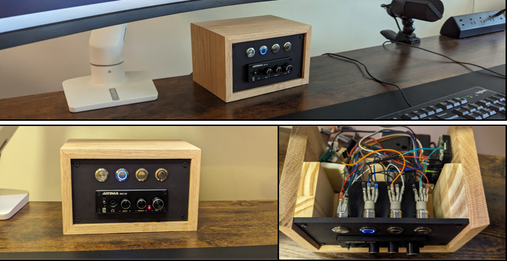

# PC Switcher



## Install as a service

```
sudo ln -s /home/lkary/src/pc-switcher/pc-switcher.service /lib/systemd/system/pc-switcher.service
```

Enable the service:

```
sudo systemctl enable pc-switcher.service
```

Similarly, to start, stop, or disable it:

```
sudo systemctl start pc-switcher.service
sudo systemctl stop pc-switcher.service
sudo systemctl disable pc-switcher.service
```

## Debugging

### TCP Server

Use `tcp_client_main.py` to send echo messages to the server. These messages 
are noop, but the server acknoledges them in the logs.

### USB Hub

Run the manual test:

```
sudo systemctl stop pc-switcher.service

cd ~/src/pc-switcher/
python usb_hub_test.py
```

This will cycle through the 4 positions and return to the initial position.

### Panel Button LEDs

Run the manual test:

```
sudo systemctl stop pc-switcher.service

cd ~/src/pc-switcher/
python panel_button_leds_test.py
```

### Check Panel Button Presses

Run the manual test:

```
sudo systemctl stop pc-switcher.service

cd ~/src/pc-switcher/
python panel_buttons_test.py
```